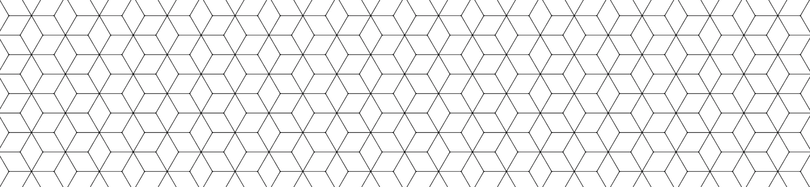

# Object Oriented Design Patterns

## Creational Patterns
- [x] Singleton
- [x] Factory
- [ ] Abstract Factory
- [ ] Prototype
- [ ] Builder

## Structural Patterns
- [ ] Flyweight
- [ ] Adapter
- [ ] Composite
- [ ] Facade
- [x] Proxy
- [ ] Decorator
- [ ] Bridge

## Behavioral Patterns
- [ ] Strategy
- [ ] Command
- [ ] Iterator
- [ ] Templete Method
- [ ] Observer
- [ ] Memento
- [ ] Mediator
- [ ] Chain of Responsibility
- [ ] Visitor
- [ ] State

## Other Patterns
- [ ] Null Object

## TypeScript

